# DataStructures
Data Structures in C


It’s impossible to name all data structures (there are infinitely many variants and specialized forms), but below is a comprehensive overview of many commonly known or fundamental data structures. They are often grouped by the type of operations they support and how they store data. Each bullet below is itself a broad category or a well-defined data structure.

# 1. Linear Data Structures
## Dynamic Array

A contiguous block of memory storing elements of the same type or of different types (generic Dynamic Array). Access by index in O(1).


## Linked List
### Description
A linked list is a fundamental data structure where each element (node) holds some data and a reference (pointer) to one or more other nodes. Unlike arrays (which store elements contiguously in memory), a linked list’s elements can be scattered throughout memory, with each node “linking” to the next node in the sequence. This structure enables flexible insertion and deletion operations without shifting large blocks of memory.

In the simplest form—a singly linked list—each node has:

Data: The value or payload the node holds (e.g., an integer, string, or any other structure).
Pointer to the next node: A reference (or pointer) to the next node in the sequence.
A standard singly linked list has:

A special pointer called the head that points to the first node.
The last node’s pointer to “next” is typically NULL, indicating the end of the list.

head -> [ data | next ] -> [ data | next ] -> ... -> NULL

### Complexity:

Typically O(n) because you usually have to traverse the list from the beginning until you find the target or reach the end.


## Doubly Linked List: 
Like a linked list except that each node has pointers to both next and previous nodes.

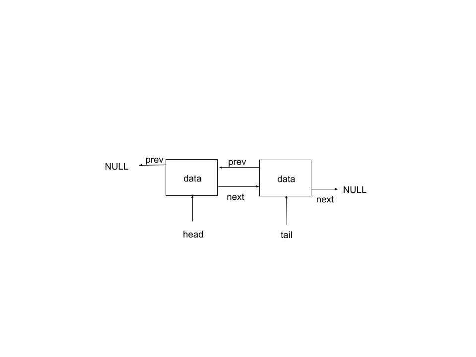

## Circular Linked List: 


## Stack

Follows LIFO (Last-In, First-Out) semantics.
Operations: push, pop, peek.
Implemented via arrays or linked lists.


## Queue

Follows FIFO (First-In, First-Out) semantics.
Operations: enqueue, dequeue.
Often implemented with arrays or linked lists.


## Deque (Double-Ended Queue)

Allows insertion and removal at both ends.
Can simulate stacks and queues, and is typically implemented via a linked list or a specialized array structure.


## String

Conceptually can be seen as an array of characters (plus a terminator in many languages).
Specialized operations like concatenation, substring, etc.

### Common C String Functions

Below is a list of commonly used C string functions from the `<string.h>` library:

---

#### 1. `strlen`
- **Description**: Calculates the length of a string (number of characters) excluding the null terminator (`\0`).
- **Syntax**: `size_t strlen(const char *str);`
- **Example**: 
  ```c
  char str[] = "Hello";
  size_t len = strlen(str); // len = 5

#### 2. `strcpy`
- **Description**: Copies the contents of one string (including the null terminator) to another
- **Syntax**: `char *strcpy(char *dest, const char *src);`
- **Example**: 
  ```c
  char str[] = "Hello";
  char dest[10];
  strcpy(dest, src); //dest = "Hello"

#### 3. `strncpy`
- **Description**: Copies up to n chars from one string to another. If src is shorter than n, the remaining chars in dest are padded with null bytes
- **Syntax**: `char *strncpy(char *dest, const char *src, size_t n);`
- **Example**: 
  ```c
  char str[] = "Hello";
  char dest[10];
  strncpy(dest, src, 3); //dest = "Hel"


#### 4. `strcat`
- **Description**: Appends (concatenates) one string to the end of another
- **Syntax**: `char *strcat(char *dest, const char *src);`
- **Example**: 
  ```c
  char dest[20] = "Hello";
  char src[] = " World";
  strcat(dest, src); //dest = "Hello World"

#### 5. `strncat`
- **Description**: Appends up to n charachters from one string to the end of another
- **Syntax**: `char *strncat(char *dest, const char *src, size_t n);`
- **Example**: 
  ```c
  char dest[20] = "Hello";
  char src[] = " World";
  strcat(dest, src, 3); //dest = "Hello Wo"

#### 6. `strcmp`
- **Description**: Compares two strings lexicographically. Returns 0 if the strings are equal. A negative value if str1 is less than str2. A positive value if str1 is greater than str2.
- **Syntax**: `int strcmp(const char *str1, const char *str2);`
- **Example**: 
  ```c
  char str1[] = "Hello";
  char str2[] = "World";
  int result = strcmp(str1, str2); //result < 0

#### 7. `strncmp`
- **Description**: Compares up to n characters of two strings lexicographically.
- **Syntax**: `int strncmp(const char *str1, const char *str2, size_t n);`
- **Example**: 
  ```c
  char str1[] = "Hello";
  char str2[] = "Heaven";
  int result = strcmp(str1, str2, 2); //result = 0 (first 2 characters are equal)

#### 8. `strchr`
- **Description**: Finds the first occurrence of a character in a string. Returns a pointer to the character or NULL if not found
- **Syntax**: `char *strchr(const char *str, int c);`
- **Example**: 
  ```c
  char str[] = "Hello";
  char *ptr = strchr(str, 'e'); //ptr points to 'e'

#### 9. `strrchr`
- **Description**: Finds the last occurrence of a character in a string. Returns a pointer to the character or NULL if not found
- **Syntax**: `char *strrchr(const char *str, int c);`
- **Example**: 
  ```c
  char str[] = "Hello";
  char *ptr = strrchr(str, 'l'); //ptr points to the second 'l'

#### 10. `strstr`
- **Description**: Finds the first occurrence of a substring in a string. Returns a pointer to the beginning of the substring or NULL if not found.
- **Syntax**: `char *strstr(const char *haystack, const char *needle);`
- **Example**: 
  ```c
  char str[] = "Hello World";
  char *ptr = strstr(str, 'World'); //ptr points to 'World'

#### 11. `strtok`
- **Description**: Splits a string into tokens based on a set of delimiters. Modifies the original string by inserting null terminators.
- **Syntax**: `char *strtok(char *str, const char *delim);`
- **Example**: 
  ```c
  char str[] = "Hello,World,How,Are,You";
  char *token = strtok(str, ",");
  while (token != NULL){
	printf("%s\n", token);
	token = strtok(NULL, ",");
  }

## Skip List


A layered, probabilistic data structure that allows O(log n) average insertion/search/deletion.
Conceptually built on top of a linked list with additional “express” links to skip over nodes.

`insert(SkipList *sl, void *data)` The way the insert algorithm works. First we create an update list, which will help us in the last step when going to update the references and insert the new node. The goal of the algorithm is to create this update list and then use it. So first we want to skip over the top level to a node that is right before our possible insertion point. Then we move down and skip from that same node (current is used at multiple levels). This means that our skipping is leading to log(n) performance, because we are carrying the node over to the next levels. Every level of the structure we want to update the last node we skipped to into our update list. So at level 2 update[1]=current after we skipped current over. At level 1 update[0]=current after we skipped, etc. Once we have updated update[], we then want to check if the data in our skip list contains the insertion data. This means we update current one last time to current = current->forward[0]. Current could be Null at this point, but it might contain the exact data we are trying to insert. We check and return if so, otherwise we no longer need current as our update table remembers how far we skipped at each level. Now we need to flip a coin to see how many nodes are to be inserted in a tower like structure. We update sl->level and add new levels as needed to update[newLevel]. Next we create the data for the new node. Finally we use the update list to insert the new node at each level, updating references.

## Hash Table (a blend of linear and specialized structure)


Stores key–value pairs for average O(1) lookup and insertion, but can degrade to O(n) in worst case.
Common collision handling methods: chaining (linked lists) or open addressing (linear probing, quadratic probing, etc.).

# 2. Trees
## Binary Tree

Each node has up to 2 children (left, right).
Used for hierarchical data, expression parsing, etc.

## Binary Search Tree (BST)

A binary tree enforcing ordering constraints: all keys in the left subtree < node’s key, and all keys in the right subtree > node’s key.
Allows search, insertion, and deletion in O(h) time, where h is tree height.


## Balanced Trees

Red-Black trees and AVL trees are both self-balancing binary search trees, guaranteeing O(logn) time complexity for insertions, deletions, and lookups. However, they balance themselves in different ways and have slightly different performance characteristics, which can make Red-Black trees preferable in some scenarios:

### Fewer Rotations on Updates

Red-Black trees typically perform at most two rotations to rebalance after an insertion or deletion.
AVL trees, being more rigidly balanced (height-balance), can require several rotations in the worst case for a single insertion or deletion.

If your application involves many insertions and deletions, the fewer rotations in a Red-Black tree can lead to better overall performance.
Easier (in Practice) to Implement

While both data structures can be implemented with standard balancing logic, many programmers find the Red-Black insertion and deletion rules to be a bit more straightforward compared to tracking balance factors and performing the “rotation cascades” typical of AVL trees.

This practical simplicity and conventional use is one reason libraries like the C++ std::map and std::set or Java’s TreeMap are traditionally implemented as Red-Black trees.
Less Strict Height Balancing

An AVL tree maintains a very strict balance condition (the difference in heights of left and right subtrees for any node is at most 1), so it tends to have a smaller height, which is good for lookups but can cause more rotations to maintain that property.

A Red-Black tree’s balance criterion is looser (color-based rules rather than exact height checks), resulting in slightly taller trees on average but fewer, simpler rebalancing operations.

### Good “All-Around” Performance

AVL: Usually has faster lookups if your dataset is fairly static (because its height is more tightly controlled), but insertions and deletions can be more expensive due to extra rotations.

Red-Black: Offers a good balance of performance across all operations—lookups, insertions, and deletions—making it a common default choice when you need a general-purpose self-balancing BST.

### When NOT to Choose a Red-Black Tree Over AVL

If search performance is the absolute priority (e.g., you have very few inserts/deletions but lots of lookups), then AVL might offer a slight edge because it’s more strictly balanced, ensuring a shorter height.

If the rotation cost is not significant in your application and you want the best possible search times, you might prefer an AVL tree.
In practice, however, Red-Black trees are often used as the standard go-to self-balancing BST in many libraries because they provide efficient and predictable performance over a wide range of operations and use cases.


### AVL Tree


### Red–Black Tree
#### 5 Primary Rules:

1. A node is either red or black
2. Root is always black
3. New insertions are always red (and then are recolored depending on the circumstances)
4. Every path from root to leaf has the same number of black nodes.
5. No path can have two consecutive red nodes
6. Nulls are black
#### Rebalancing:
1. If we have a black aunt, we rotate (BAR). After a rotation the three nodes we are working on end up as 
	black
 	/   \
      red   red
2. If we have a red aunt, we color flip. After a color flip the three nodes we are working on end up as
	Red
       /   \
    black  black

https://www.youtube.com/watch?v=nMExd4DthdA&list=PLOXdJ6q8iu4MneI9gySCHiyzAQcveqkIO


### Splay Tree
#### The 'key' to understand 'splaying'
Even if a search for a key fails (the key doesn't exist), splaying brins the node closest to that key to the root. This is beneficial if future searches are near that same key or if you end up inserting that key next (the place it needs to ggo is now near the root). Similarlyy, after you insert a node or delete a node, you splay so that frequent or recent acesses stay near the top.
#### Primitive Rotations


#### 6 differrent cases:
1. Rotate Left
2. Rotate Right
3. Rotate Right Right
4. Rotate Left Left
5. Rotate Right Left
6. Rotate Left Right

#### Examples of Different types of rotations for splay trees:


#### Splaying


### Treap
A Treap is a binary search tree on keys and a heap on random priorities. After each standard BST insertion, rotations ensure that a node’s parent always has a larger or equal priority. Because priorities are random, the tree is balanced in expectation with O(log n) average operation time.

#### BST property (by key):

For any node, all keys in its left subtree are smaller than the node’s key, and all keys in its right subtree are larger.
Heap property (by priority):

Each node also has a priority (often a random number).
For a max-heap property, for example, a node’s priority is greater than or equal to the priorities of its children.

In practice, the priority is usually chosen randomly when a node is inserted.
When you insert a node, you:

First insert it into the BST by key (as if you were inserting into a regular BST).
Then “rotate” the node up or down to fix any violation of the heap property (i.e., making sure each node’s priority remains higher or equal to its children if using a max-heap convention).
#### When you delete a node, you:

“Rotate” the node down until it becomes a leaf (fixing the heap property by rotating it towards a direction that maintains the priority structure).
Then remove it from the tree.

#### Why randomize?
By assigning random priorities to each node and imposing the heap property, the tree’s shape tends to be balanced on average. Specifically, the expected height of a treap is O(log n) with high probability, leading to average O(log n) times for operations such as search, insert, and delete.

#### Key Takeaways
A treap is a BST with respect to the key and a heap with respect to the priority.
The priorities are typically random, which ensures a high probability of balanced trees without complex balancing steps used by other self-balancing BSTs (like AVL or Red-Black Trees).
All main operations (search, insert, delete) can be performed in O(log n) expected time.

#### Insertion Example

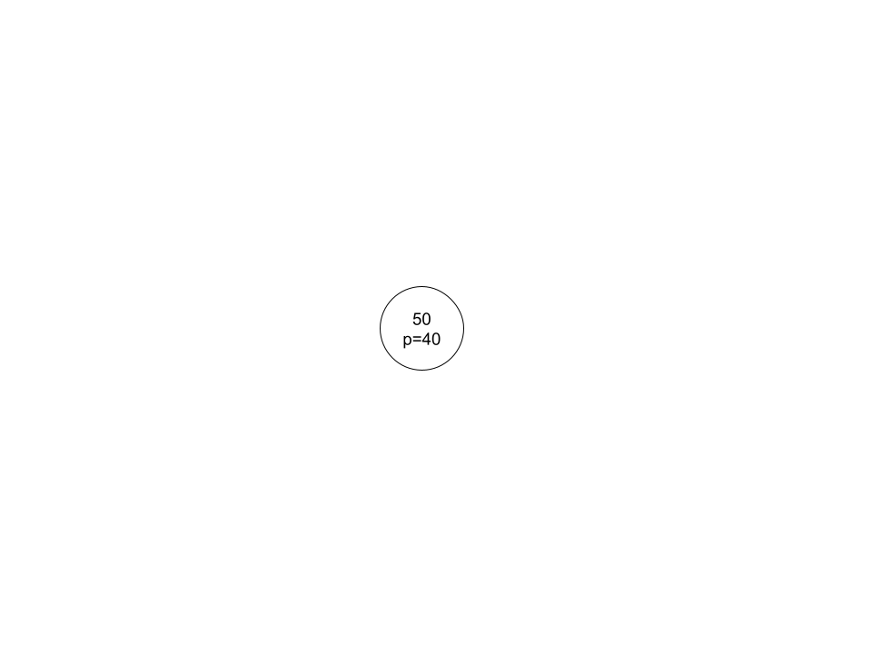
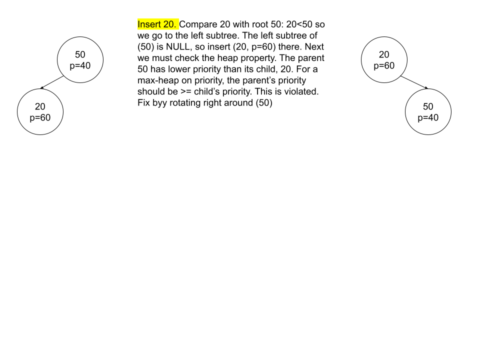
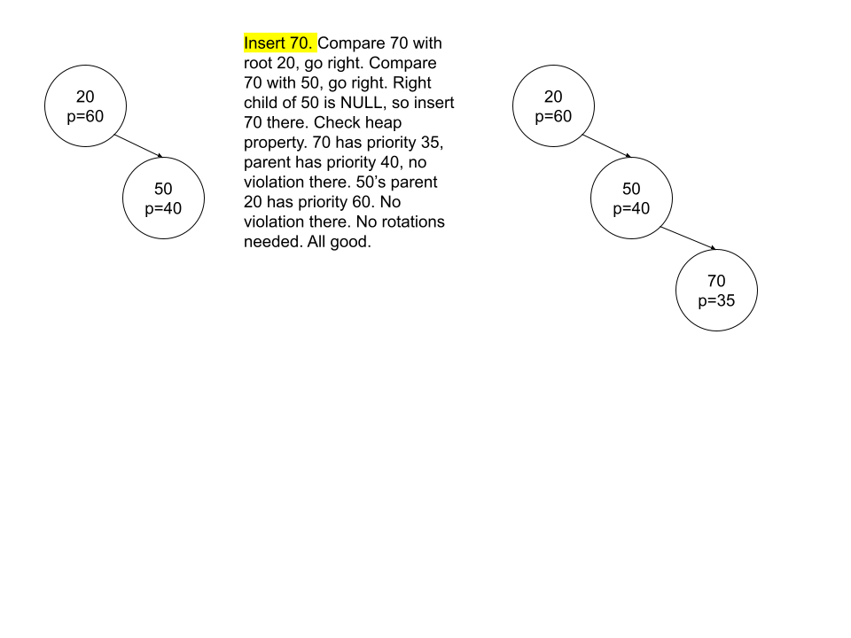
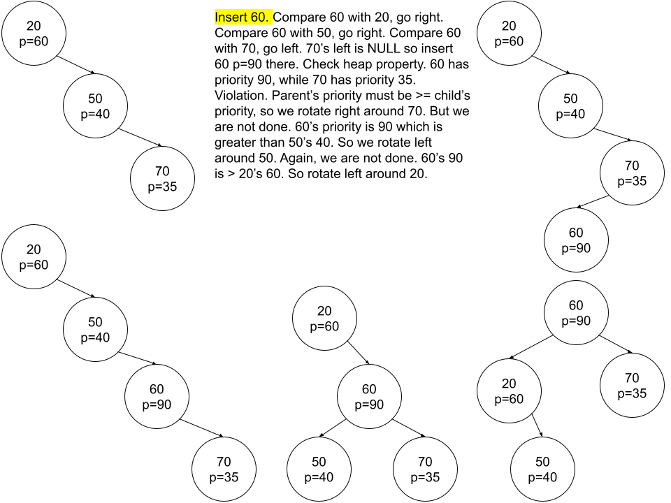
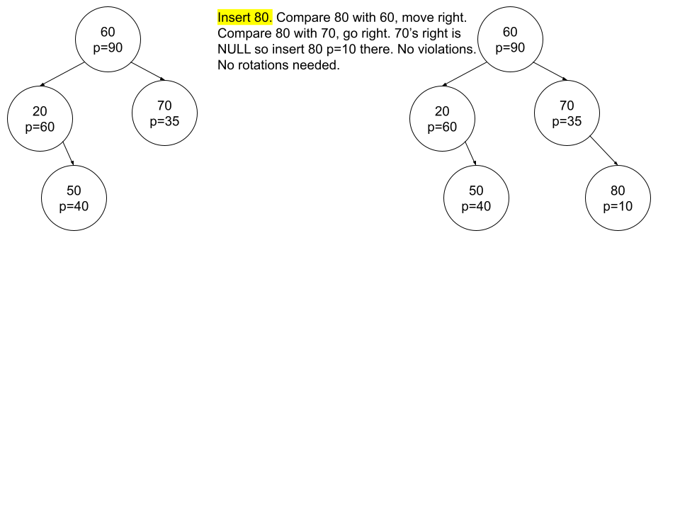


#### Deletion Example
Treap deletion rules:
1. Find the node via standard BST search (compare keys, go left/right)
2. If the node has:
   - 0 children (leaf): just remomve it
   - 1 child: remove the node and link the child up
   - 2 children: rotate the node down (left or right) until it becmes a case of 0 or 1 child, then remove it.
     	The rotation direction depends on the priorities of the child subtrrees. If left->priority > right->priority, rotate right. Else, rotate left. This pushes down the node to be deleted while keeping the heap property intact on each step.

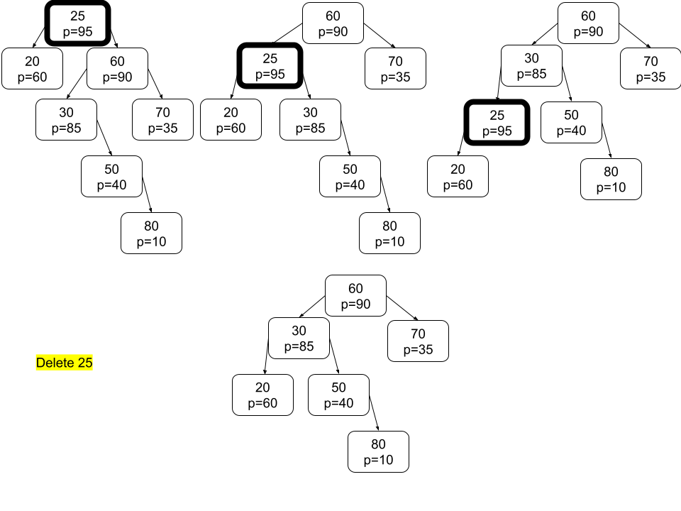
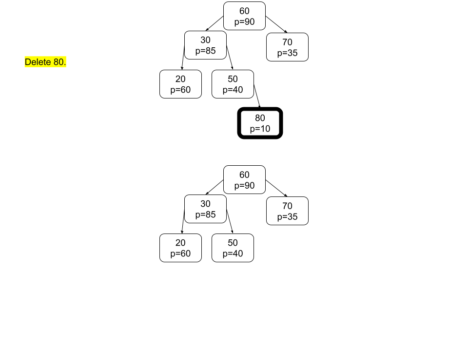  
     
### B-Tree
A B-tree is a self-balancing tree data structure commonly used in databases and file systems to store and manage large volumes of data efficiently. Unlike traditional binary search trees, which have at most two children per node, B-trees can have many children per node (often called "branches" or "subtrees"). This multi-way branching design enables B-trees to maintain shallow height even with large data sets, leading to fewer disk or I/O operations—an especially important consideration in database and storage systems.

#### Here are some key points about B-trees:

1. Multi-way branching:
- Each node can have multiple keys (or values) and can point to multiple children.
- The number of keys and children in a node is constrained by a parameter typically called the order or minimum degree of the B-tree.

2. Height is kept small:
- Because each node can hold multiple keys, the tree’s height grows more slowly than a regular binary tree.
- This reduces the number of disk accesses needed to find or insert data.

3. Balanced structure:
- B-trees enforce balance by ensuring that each non-root node has at least a certain minimum number of keys and children, and up to a defined maximum.
- As new keys are inserted or old keys are deleted, nodes split or merge to maintain balance, preventing the tree from becoming too tall or skewed.

4. Efficient insertion, deletion, and search:
- All of these operations can be performed in O(log n) time.
- B-trees are designed for scenarios where slow disk access (or other forms of high-latency storage access) dominates performance.
- By minimizing the number of disk reads/writes, B-trees achieve better overall performance.
5. Common uses:
- Database indexing (e.g., many database management systems use B-trees or variants like B+ trees to store index data).
- File systems (often used to store directory information, file metadata, and block indices).
- Key–value stores and other high-performance storage engines.

6. Variants of B-trees:
- B+ tree: A popular variant where all values (records) are stored in the leaf nodes, and internal nodes store only keys used for navigation. This design can provide better range query performance.
- B-tree*, B#-tree, etc.: Variants focusing on different performance characteristics or implementation details.

Overall, the B-tree’s design is tailored for environments where data must be read from and written to large, slow storage blocks (such as disk pages). By storing multiple keys per node and keeping the tree height small, B-trees reduce expensive I/O operations, making them ideal for large-scale data storage systems.


#### In a B-Tree, we need to differentiate between leaf nodes and internal nodes for several reasons:

1. Traversal Logic

- When searching for a key, if you reach a leaf node and still haven’t found the key, you know the key is not in the tree.
- Conversely, if a node is not a leaf (i.e., an internal node), you know there are child pointers you can (and should) follow to continue your search.
2. Insertion and Split Rules

- Insertion behaves differently depending on whether the node is a leaf or internal.
- In a leaf node, you can directly insert the new key (if there is room).
- In an internal node, you typically descend into a child. If that child is full, you split it first, then move down to the correct child.
- Knowing if a node is a leaf is critical for deciding these steps.
3. Deletion Logic

- When deleting a key, if it is found in a leaf, you simply remove it.
- If found in an internal node, you have to swap with a predecessor (or successor) key or merge children.
- The deletion algorithm for B-Trees is more involved, but it always checks whether a node is leaf to decide which case applies.
4. Implementation Simplification

- Marking a node as leaf = true or false makes the code simpler: you don’t have to guess if the children[] array is valid or not.
- A leaf node has no valid children, whereas an internal node must keep track of them.
- This single boolean flag allows quick checks anywhere in the code to determine how to handle that node.

So, the leaf flag makes it efficient and clear to handle B-Tree nodes differently when they do or do not contain child pointers.

#### Important Note on splitting:
When you insert, you start at the root and mmove down through the children until you reach the appropriate leaf. If the root is full from the start, you'll eventually have to split it anyway. It's easierr and cleaner to split before descending. After the root is split, the newly created root will have fewerr keys, and you can keep descending to the correct leaf child, splitting chhild nodes as needed along the way.

#### Important Note on Searching:
We use a linear scan for the key:
`for(i=0; i<cur->nkeys && tree->cmp(keyy, cur->keys[i])>0; i++);`
The loop advances i until one of the two conditions is met:
1. We have checked all cur->nkeys
2. We encounter a key that is greater than or equal to key.

Next we check if we encountered the key

`
if (i<cur->nkeys && tree->cmp(key, cur->keys[i])==0){return cur->keys[i];}
`

`
else if (cur->leaf){return NULL;}
`

`
else {cur=cur->children[i];}
`

The final statement is of incredible importance:
1. It shows how the B-Tree is structured.
2. If we stop on the i'th key in the key list, then we also descend into the i'th child.
3. To understand further, you would need to understand how the insert function works for B-Tree
4. Remember B-Tree's have nodes that have between t-1 and 2t-1 keys, and the number of children = (number of keys)+1
5. If a node has n keyys, they act as "dividers" splittingg the key space into n+1 regions. Each gap corresponds to one child pointer

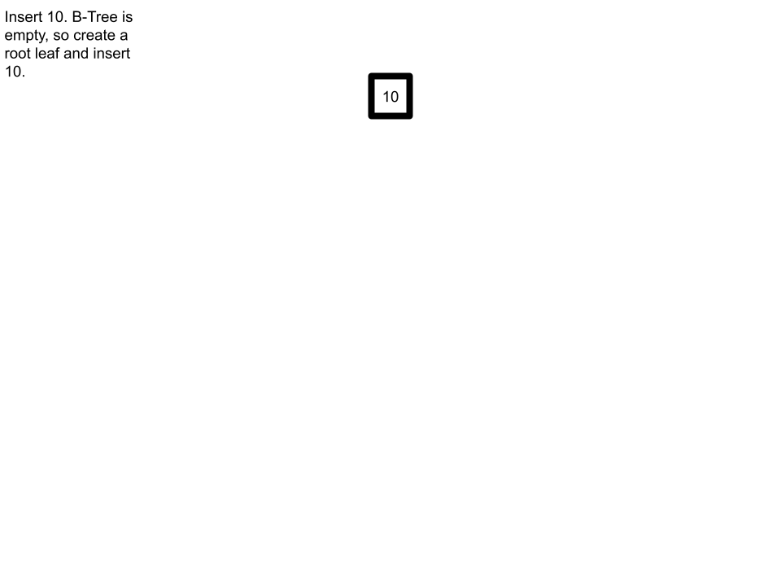
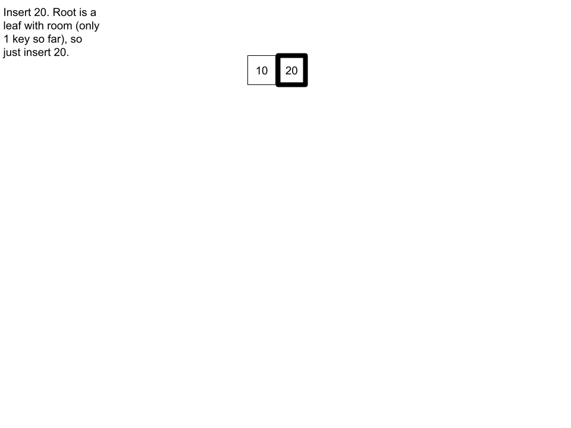
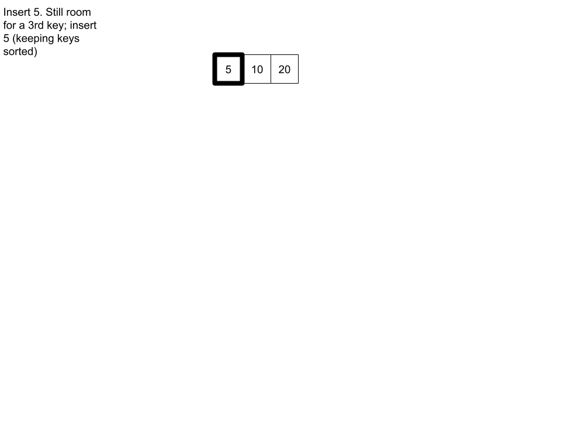
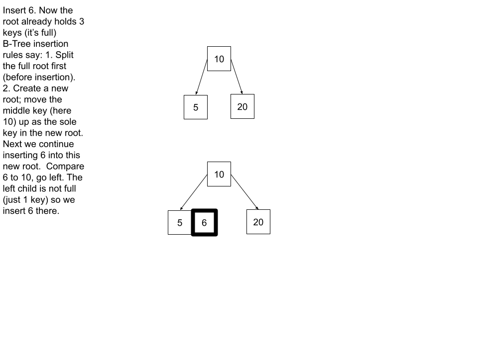
.png "BTree5")
.png "BTree6")
.png "BTree7")
.png "BTree8")
.png "BTree9")
.png "BTree10")

### B+ Tree (often used in databases and filesystems)

## Heap/Priority Queue

A specialized tree-based structure (often represented implicitly via an array) where the parent’s key is either always larger (max-heap) or smaller (min-heap) than its children.
Supports efficient retrieval of min/max in O(1) and insertion/deletion in O(log n).

## Trie (Prefix Tree)

A tree specialized for storing strings by character.
Each edge typically represents one character. Enables fast prefix lookups.

## Segment Tree

Specialized tree for storing information about intervals, segments (e.g., sums over array ranges).
Allows O(log n) queries and updates on intervals.

## Fenwick Tree (Binary Indexed Tree)

A compact structure for cumulative frequency tables or prefix sums.
Supports O(log n) update and prefix-sum queries.
Disjoint Set (Union-Find)

Not a tree in the traditional sense, but often implemented with “forest” of trees.
Tracks elements partitioned into a number of disjoint (non-overlapping) sets. Supports fast union and find operations.

# 3. Graphs and Graph Representations
## Graph (in general)

A set of vertices (nodes) connected by edges (links).
Can be directed, undirected, weighted, or unweighted.

## Adjacency List

Each node has a list of its neighbors. More efficient for sparse graphs.

## Adjacency Matrix

A 2D matrix (size V×V) indicating existence/weight of edges. Easier for dense graphs or if you need fast existence checks.

## Incidence List / Incidence Matrix

Less commonly used but sometimes helpful for certain algorithms.

# 4. Specialized/Advanced Data Structures
## Suffix Tree

A compressed trie of all suffixes of a given string. Enables fast substring queries.
Construction can be O(n) with advanced algorithms (e.g. Ukkonen’s).

## Suffix Array

An array of all suffixes of a string in sorted order, often combined with additional structures (e.g., LCP array).
Requires less memory than a suffix tree, but certain queries can be slightly slower.

## Bloom Filter

A probabilistic data structure to test membership in a set. Can yield false positives but never false negatives.
Extremely space efficient for large sets with a known false-positive rate.

## LRU Cache

Conceptually a specialized structure combining a hash map + doubly linked list to track the least recently used items for quick eviction.

## R-Tree (and variants)

A tree for spatial data (rectangles, polygons, etc.). Useful in GIS and spatial indexing.

## Quadtree, Octree

Multi-level tree where each node can have 4 (quadtree) or 8 (octree) children for partitioning 2D or 3D space respectively.

## Order Statistic Tree

A self-balancing BST that also keeps track of subtree sizes, enabling rank queries (“what is the k-th smallest element?”) in O(log n) time.

## Van Emde Boas Tree

A tree-like structure for integer keys in a bounded universe. Achieves O(log log M) operations for a universe of size M.

## Cartesian Tree, Treap

Hybrids of BST + heap properties for specialized use.
# 5. Persistent Data Structures
Versions of lists, trees, tries, etc. that keep previous versions of themselves immutable while still allowing new updates.
Uses structural sharing to avoid copying entire data structures on each modification.

# Choosing the Right Data Structure
## Constraints: How large can the data get? How many operations do you need to perform, and how fast do they need to be?
## Operations: Do you need random access, or is sequential enough? Do you need to search, insert, delete quickly, or do range queries, or do merges?
## Memory: Are you memory-constrained (e.g., small embedded system) or do you have plenty of RAM?
While it’s not practical to list every data structure ever conceived (there are many domain-specific or hybrid variations), this overview should give you a sense of the major categories and common data structures you’ll encounter in computer science and software development.


